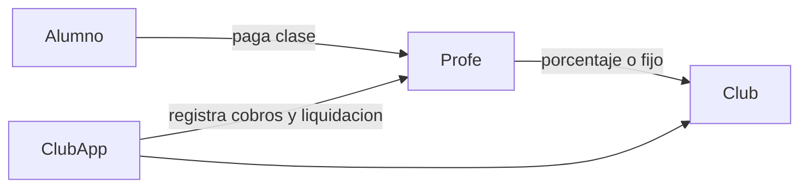
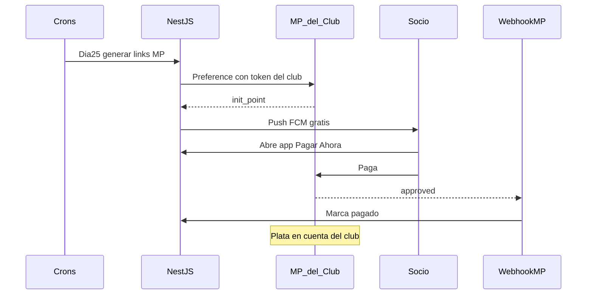
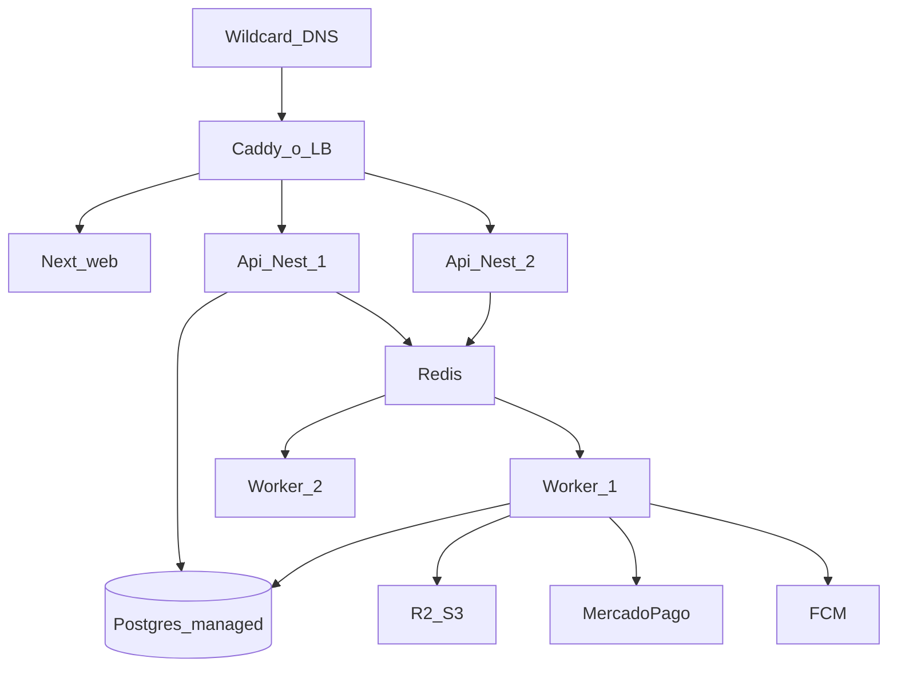

# ClubApp Arg — MVP Multi-tenant (alcance completo)

## Por qué Web + App

| Canal | Quién | Para qué |
|-------|--------|----------|
| **Web** (`tuclub.clubapp.com.ar`) | Secretario, tesorero, presidente | Planillas, CSV, cobros, noticias, horarios, reportes, push masivo |
| **App** | Socio y profe | Cuota/pagar, carnet QR, horarios, noticias, asistencia (profe), justificar falta |

## Matriz de features (core + diferenciales)

### Core — Web comisión
- Alta/baja/modificar socios + import CSV
- Ver quién pagó / quién debe
- Cobrar mes (links MP) + ver débito automático habilitado
- Mandar notificaciones a todos / deudores
- Subir noticias, eventos, fotos
- ABM de horarios / actividades
- ABM de **espacios reservables** (canchas pádel/fútbol/básquet/tenis, quinchos, salones) + calendario de reservas + cancelar/bloquear
- Reporte **Alerta de Fuga** (morosos 2+ meses + caída de asistencia) + **WhatsApp one-tap**
- Dashboard **“Hoy en el club”** + **ranking de cobranza** (% cobrado del mes)
- Reglas de morosidad configurables
- Grupos familiares, actividades/multideporte, torneos, invitados (ABM)
- White-label (`logo_url`, `color_primario`)

### Core — App socio
- Ver cuota + pagar con MercadoPago (link)
- Activar débito automático (tokenizar tarjeta 1 vez)
- Carnet digital QR + **modo offline 24–48h**
- Ver horarios / noticias / fotos / push
- Justificar falta con audio
- **Reservar** espacios + **lista de espera** (“avisame si se libera”)
- Ver grupo familiar / actividades inscritas
- Generar **invitado / day pass** (QR temporal)
- Ver torneos / fixture / tabla (read) y resultados si aplica

### Core — App profe (Modo Profe)
- Login con rol `profe`
- Elegir actividad/horario del día
- Pasar asistencia (presente/ausente) sobre lista de socios
- (Opcional UX) escanear QR del carnet para marcar presente

### Core — App entrada (Modo Entrada / portería)
- Rol `entrada`: usuario de puerta (no es admin completo ni socio)
- Sesión fija en un celular: **scan QR en loop**
- Semáforo según **reglas del club** (cuotas adeudadas, suspendido, etc.)
- Log `Acceso`; reemplaza lector QR hardware (~USD 50)

### Fuera del MVP (después)
- **Modo cantina / consumo** (cargar al socio y descontar) — más complejo; no entra en las fases 1–4

## Configuración por club (cada admin edita solo su perfil)

**Sí.** Las reglas **no son globales** de la plataforma: cada establecimiento tiene su propio perfil (`Club`) y el `admin` de ese tenant edita **solo su club**.

- Multi-tenant: `GET/PATCH /clubs/me/config` siempre scoped por `club_id` del JWT.
- El admin de “Club A” **no puede ver ni cambiar** la config de “Club B”.
- Rol `entrada` / `socio` / `profe`: **solo lectura** de las reglas que les aplican (no editan config).
- Defaults al crear el club; después cada comisión los ajusta en **`/admin/config`**.

### Qué puede configurar cada club (MVP)

| Ajuste | Ejemplo | Campo |
|--------|---------|--------|
| Umbral moroso | “Debes **2** cuotas” vs “Debes **3**” | `regla_moroso_cuotas` |
| Bloquear reservas si moroso | Sí / No | `bloquear_reservas` |
| Bloquear entrada (Modo Entrada) si moroso | Sí / No | `bloquear_entrada` |
| Cumpleaños automáticos | On / Off | `cumples_auto` |
| Máx. reservas futuras por socio | 2 (default) | `max_reservas_activas` |
| Cancelar reserva hasta | 2 horas antes | `cancelar_reserva_horas` |
| Monto cuota base | $5000 | `cuota_monto` |
| Branding | logo + color | `logo_url`, `color_primario` |
| Horario general del predio (opcional) | 8–23 | o por `Espacio` |

La app (reservas, entrada, cobros) **lee siempre la config del club logueado**; nunca constantes hardcodeadas de “todos los clubes iguales”.

## Cobro de actividades / profes (2 modelos reales)

En la calle conviven dos esquemas. **Cada `Actividad` elige el suyo** (un club puede tener fútbol en modo A y pádel en modo B).

### Modo A — Extra dentro de la cuota del club (ya contemplado)

El club cobra al socio: **cuota base + adicionales** de las actividades en las que está anotado.

- `Actividad.modo_cobro = "club"`
- `Actividad.monto_adicional` (ej. +$3000 natación)
- Al “Cobrar mes”: `monto = cuota_monto (+ grupo familiar) + sum(adicionales del socio)`
- El dinero entra a la **cuenta MP del club**
- El profe puede ser empleado/acuerdo interno del club (la app no reparte ese extra al profe en MVP)

**Cubierto:** sí, con `SocioActividad` + lógica de cobro del mes.

### Modo B — Cobra el profe y le pasa un % al club (nuevo en el plan)

El alumno le paga al profe (clase/entrenamiento). El profe le debe al club un **porcentaje o monto fijo** por uso de cancha/espacio (“alquiler”).

- `Actividad.modo_cobro = "profe"`
- `Actividad.profe_id` (socio con rol profe)
- `Actividad.comision_tipo` = `porcentaje` | `fijo`
- `Actividad.comision_valor` = ej. `20` (%) o `$5000` fijos por alumno/mes
- Flujo MVP (simple, sin split MP automático):
  1. Profe en la app ve su lista de alumnos de esa actividad
  2. Marca **“cobrado”** por alumno/mes (o importa totales)
  3. El sistema calcula **“Debe al club”** = suma comisiones
  4. Web admin: pantalla **Liquidaciones profe** — pendiente / pagado al club
  5. Opcional: preference MP para que el **profe le pague al club** esa liquidación
- **Efectivo / transferencia / MP personal del profe:** sí, el profe lo **registra manualmente** en la app (check “Cobrado” + medio: `efectivo` | `transferencia` | `mp` | `otro`). La app no se entera sola si el billete cambió de mano.
- Atajos UX: marcar varios alumnos a la vez (“cobré a toda la clase hoy”) y editar/deshacer si se equivocó.
- Post-MVP: link de pago del profe al alumno (ahí sí podría marcarse solo) o split MP



### Resumen

| Pregunta | Respuesta |
|----------|-----------|
| ¿Extra en la cuota del club? | **Sí, Modo A** (ya estaba) |
| ¿Profe cobra y reparte al club? | **Sí, Modo B** (queda sumado al plan) |
| ¿Mismo club, ambos modos? | **Sí**, por actividad |
| ¿Quién configura? | Admin del club en ABM de actividades |

## Diferenciales de producto (roadmap)

### Alto impacto — Fase 2 / 2b

| Diferencial | Qué es | Notas de diseño |
|-------------|--------|-----------------|
| **Familia / grupo familiar** | Un pago, varios DNIs (titular + hijos) | `GrupoFamiliar` + `Socio.grupo_id`; cuota del grupo; carnets individuales; tesorero ve “Familia Pérez — 4 socios” |
| **Lista de espera en reservas** | Si el slot está ocupado → “Avisame si se libera” | `ListaEspera`; al cancelar reserva → push al primero de la cola (TTL corto para confirmar) |
| **Torneos / fixture simple** | Crear torneo, fixture, resultados, tabla | `Torneo`, `Partido`; web carga resultados; app muestra fixture/tabla (fútbol/pádel) |
| **Moroso con reglas del club** | Cada admin define las suyas en `/admin/config` | `regla_moroso_cuotas`, `bloquear_reservas`, `bloquear_entrada` — **por club**, no globales |
| **Carnet / comprobante offline** | QR + estado de cuota cacheados 24–48h | AsyncStorage/SecureStore en app; badge “sin conexión”; refresh al volver online |

### Muy vendedores en demo — Fase 1b / 2

| Diferencial | Qué es | Notas |
|-------------|--------|--------|
| **Cumpleaños del socio** | Push + noticia automática “Hoy cumple…” | Campo `fecha_nacimiento`; cron diario; opt-out simple |
| **“Hoy en el club”** | Un glance: turnos, reservas del día, deudores, alertas | Home web admin (reemplaza dashboard genérico) |
| **Multideporte / cobro actividad** | Dos modos por actividad (ver sección abajo) | Modo A: extra en cuota del club. Modo B: cobra el profe + % al club |
| **Invitado / day pass** | QR temporal para un amigo | `Invitado` con `vence_at`, QR `club_id:inv:token`; Modo Entrada lo reconoce; pago MP opcional |
| **WhatsApp one-tap** | Desde Alerta de Fuga → wa.me con texto armado | No reemplaza push; deep link `https://wa.me/54…?text=` |

### SaaS serio — Fase 4 (producto/plataforma)

| Diferencial | Qué es | Notas |
|-------------|--------|--------|
| **Onboarding self-serve** | El club se registra, logo, Excel, conecta MP | Flujo `/onboarding` público; hoy el alta puede ser manual en Fase 1 |
| **Ranking de cobranza** | “Este mes cobraste el 92%” | KPI en “Hoy en el club”; historial mensual simple |
| **Modo cantina / consumo** | Cuenta corriente / consumos | **Después del MVP** — no implementar en fases 1–4 |

## Modelo de negocio: no cobramos / no custodiamos fondos

**Reglas duras (producto + legal + tech):**

1. **ClubApp Arg NO cobra.** No recibe la cuota del socio. Solo genera links de MercadoPago (Checkout Pro / `init_point`) con la cuenta **del club**.
2. La plata va a la **MP del club**. Nosotros no somos intermediarios ni custodios de fondos.
3. **Producción:** el club debe tener su cuenta MP conectada (OAuth / token del club). **Prohibido** fallback a `MP_ACCESS_TOKEN` de plataforma en prod (solo sandbox/demo).
4. **Avisos de cobranza masiva = 100% push FCM** (Firebase). Costo de mensajería ≈ $0. **Prohibido** WhatsApp Business API / SMS pagos como canal de cobro.
5. WhatsApp one-tap en Alerta de Fuga (`wa.me` gratis, lo abre el tesorero) **sí** puede quedar: no es mensajería paga nuestra ni envío masivo de cuotas.
6. **Webhook ≠ cobro.** Validar firma + marcar `pagado` solo sincroniza estado en nuestra DB; el dinero ya está en MP del club.
7. **Marcar pagado manual** siempre disponible (efectivo, transferencia, si falló el webhook).

## Cobranza “Club Inteligente” (A + B) + push gratis



**Flujo push (Opción A — default):**
1. Día 25 (cron o botón web **“Generar y Enviar Cobros”**): form mes + monto → por cada socio activo crear preference, guardar `link_pago` / `mp_init_point`.
2. Push FCM a socios con token:
   - Título: `{nombre_club}: Tenés cuota pendiente`
   - Body: `Tu cuota de {mes} por ${monto}. Tocá para pagar.`
   - Data: `{ screen: "PagarCuota", cuota_id / pago_id }`
3. Socio toca noti → app abre pantalla pagar → botón abre `link_pago`.
4. Webhook (firma + `Payment.get`) marca `pagado`; si no llega, job de reconciliación o **marcar manual** en el panel.

**Opción B — Débito automático** (expansión): socio guarda tarjeta; día 1 cobro con token del club; misma regla de no-custodia.

Endpoints:
- `POST /pagos/cobrar-mes` o `POST /api/cuotas/generar-links` (mismo motor)
- `POST /api/webhook/mp` (obligatorio en prod de cobros)
- `PATCH /pagos/:id/marcar-manual` (admin)
- Cron día 25 / 1 / 5 / 10

Entidad: seguir con `Pago` del plan (= “cuota” del prompt corto: mes, monto, link, estado).

## Enfoque técnico

Monorepo en `C:\Users\leape\myprojects\mi_club_online`. Multi-tenant estricto por `club_id`. Uploads (fotos + audios) en volumen Docker `./uploads` servido por la API.

**Defaults:**
- Compose: `postgres` + `api` + `web` + volume uploads. Expo fuera de Docker.
- Tenant: subdominio / `X-Club-Slug` + JWT `club_id` + `role`.
- Roles: `admin` | `entrada` | `socio` | `profe`
  - `admin` / `entrada` viven en `Admin` (`Admin.rol`)
  - `socio` / `profe` viven en `Socio` (`Socio.rol`)
  - `entrada` solo puede usar Modo Entrada (scan + historial del día); no ve cobros ni CSV

## Estructura

```
mi_club_online/
  docker-compose.yml
  .env.example
  README.md
  uploads/                 # fotos noticias + audios justificaciones
  apps/
    api/
    web/
    mobile/
  packages/shared/
```

## Modelo Prisma (ampliado)

Tablas base: `Club`, `Admin`, `Socio`, `Pago`, `DeviceToken` (como antes).

Nuevas / campos extra:

```prisma
model Admin {
  // comisión + portería
  rol           String @default("admin") // admin | entrada
  // email, password_hash, club_id, ...
}

model Socio {
  // ...campos previos
  rol                 String  @default("socio") // socio | profe
  mp_customer_id      String?
  mp_card_id          String?
  debito_activo       Boolean @default(false)
  asistencias         Asistencia[]
  justificaciones     Justificacion[]
  accesos             Acceso[]
}

model Acceso {
  id         Int      @id @default(autoincrement())
  club_id    Int
  club       Club     @relation(...)
  socio_id   Int?
  socio      Socio?   @relation(...)
  invitado_id Int?
  dni_leido  String
  resultado  String   // permitido | denegado | desconocido
  motivo     String?  // "al_dia" | "moroso" | "suspendido" | "no_encontrado" | "invitado"
  scanned_by Int      // admin_id rol entrada
  created_at DateTime @default(now())
}

// Club: reglas + branding (editables solo por admin de ESE club)
// regla_moroso_cuotas Int @default(2)
// bloquear_reservas Boolean @default(true)
// bloquear_entrada Boolean @default(false)
// cumples_auto Boolean @default(true)
// max_reservas_activas Int @default(2)
// cancelar_reserva_horas Int @default(2)
// cuota_monto, logo_url, color_primario, mp_access_token, ...

model GrupoFamiliar {
  id          Int     @id @default(autoincrement())
  club_id     Int
  nombre      String  // "Familia Pérez"
  titular_id  Int     // socio que paga
  socios      Socio[]
}

model Actividad {
  id              Int     @id @default(autoincrement())
  club_id         Int
  nombre          String  // "Fútbol", "Natación"
  modo_cobro      String  @default("club") // club | profe
  monto_adicional Float   @default(0)      // modo club: extra en cuota
  profe_id        Int?    // modo profe: titular de la actividad
  comision_tipo   String? // porcentaje | fijo
  comision_valor  Float?  // 20 (=20%) o monto fijo
  activo          Boolean @default(true)
}

model SocioActividad {
  socio_id     Int
  actividad_id Int
  @@id([socio_id, actividad_id])
}

// Registro mensual: profe marcó que el alumno le pagó (modo B)
model CobroProfe {
  id           Int      @id @default(autoincrement())
  club_id      Int
  actividad_id Int
  socio_id     Int      // alumno
  profe_id     Int
  mes          String   // "2026-09"
  monto_alumno Float    // lo que pagó al profe (informativo)
  comision_club Float   // lo que el profe debe al club
  cobrado      Boolean  @default(true)
  medio        String   @default("efectivo") // efectivo | transferencia | mp | otro
  nota         String?
  @@unique([actividad_id, socio_id, mes])
}

model LiquidacionProfe {
  id          Int      @id @default(autoincrement())
  club_id     Int
  profe_id    Int
  mes         String
  total_club  Float    // suma comisiones
  estado      String   @default("pendiente") // pendiente | pagada
  mp_init_point String?
  fecha_pago  DateTime?
}

model ListaEspera {
  id         Int      @id @default(autoincrement())
  club_id    Int
  espacio_id Int
  socio_id   Int
  inicio     DateTime
  fin        DateTime
  estado     String   @default("esperando") // esperando | notificado | expirada | convertida
  created_at DateTime @default(now())
}

model Torneo {
  id       Int    @id @default(autoincrement())
  club_id  Int
  nombre   String
  deporte  String
  estado   String @default("activo")
}

model Partido {
  id         Int      @id @default(autoincrement())
  torneo_id  Int
  club_id    Int
  rival_a    String
  rival_b    String
  fecha      DateTime?
  goles_a    Int?
  goles_b    Int?
  jugado     Boolean  @default(false)
}

model Invitado {
  id         Int      @id @default(autoincrement())
  club_id    Int
  socio_id   Int      // quien invita
  nombre     String
  token      String   @unique
  vence_at   DateTime
  usado      Boolean  @default(false)
  monto      Float?
  pagado     Boolean  @default(false)
}

// Reservas de canchas / quinchos / salones
model Espacio {
  id              Int      @id @default(autoincrement())
  club_id         Int
  club            Club     @relation(...)
  nombre          String   // "Pádel 1", "Quincho grande"
  tipo            String   // padel | futbol | basquet | tenis | quincho | salon | otro
  descripcion     String?
  activo          Boolean  @default(true)
  duracion_slot_min Int    @default(60) // turnos de 60 min (quincho puede ser 120)
  precio_opcional Float?   // null = sin cargo extra en MVP; si hay monto, se puede pedir pago MP después
  hora_apertura   String   // "08:00"
  hora_cierre     String   // "23:00"
  reservas        Reserva[]
}

model Reserva {
  id         Int      @id @default(autoincrement())
  club_id    Int
  club       Club     @relation(...)
  espacio_id Int
  espacio    Espacio  @relation(...)
  socio_id   Int
  socio      Socio    @relation(...)
  inicio     DateTime
  fin        DateTime
  estado     String   @default("confirmada") // confirmada | cancelada | no_show
  nota       String?
  created_at DateTime @default(now())
  @@index([club_id, espacio_id, inicio])
}

model Horario {
  id          Int    @id @default(autoincrement())
  club_id     Int
  club        Club   @relation(...)
  titulo      String // "Fútbol infantil"
  dias        String // "lun,mie,vie"
  hora_inicio String // "18:00"
  hora_fin    String // "19:30"
  profe_id    Int?
  activo      Boolean @default(true)
}

model Noticia {
  id         Int      @id @default(autoincrement())
  club_id    Int
  club       Club     @relation(...)
  titulo     String
  cuerpo     String
  imagen_url String?
  es_evento  Boolean  @default(false)
  fecha      DateTime @default(now())
  published  Boolean  @default(true)
}

model Asistencia {
  id          Int      @id @default(autoincrement())
  club_id     Int
  club        Club     @relation(...)
  horario_id  Int
  horario     Horario  @relation(...)
  socio_id    Int
  socio       Socio    @relation(...)
  fecha       DateTime @db.Date
  estado      String   // presente | ausente | justificado
  marcada_por Int      // socio_id del profe
  @@unique([horario_id, socio_id, fecha])
}

model Justificacion {
  id            Int      @id @default(autoincrement())
  club_id       Int
  club          Club     @relation(...)
  socio_id      Int
  socio         Socio    @relation(...)
  asistencia_id Int?     @unique
  asistencia    Asistencia? @relation(...)
  audio_url     String
  nota          String?
  estado        String   @default("pendiente") // pendiente | aceptada | rechazada
  created_at    DateTime @default(now())
}
```

**Alerta de Fuga** (query, no tabla): socios con ≥2 cuotas `pendiente` **o** asistencia &lt; 50% en últimos 30 días (configurable). Endpoint `GET /reportes/alerta-fuga`.

## Backend NestJS — módulos

`Auth`, `Clubs`, `Socios`, `GruposFamiliares`, `Actividades`, `Pagos`, `MercadoPago`, `Horarios`, `Noticias`, `Asistencias`, `Justificaciones`, `Espacios`, `Reservas`, `ListaEspera`, `Torneos`, `Invitados`, `Accesos`, `Reportes`, `Notificaciones`, `Uploads`, `Cron`, `Prisma`.

Endpoints clave además de cobros:
- CRUD `/horarios`, CRUD `/noticias` (+ upload imagen)
- `POST /asistencias/pasar` (profe: lista `{ socio_id, estado }[]` + `horario_id` + fecha)
- `POST /justificaciones` multipart audio (`expo-av` → API)
- `PATCH /justificaciones/:id` (admin/profe acepta → marca asistencia `justificado`)
- `GET /reportes/alerta-fuga`
- `POST /notificaciones/push`
- Auth entrada: mismo login admin filtrado por `rol=entrada` (o claim en JWT)
- `POST /accesos/scan` — body `{ qr: "clubId:dni" }` → valida tenant, devuelve socio + semáforo, persiste `Acceso`
- `GET /accesos` — historial del día (admin y entrada)
- Regla de ingreso: `suspendido` / DNI inexistente → **denegado**; si cuotas adeudadas ≥ `Club.regla_moroso_cuotas` y `bloquear_entrada` → **denegado**; si adeuda pero no bloquea → **amarillo**; al día → **verde**. Invitado vigente → verde con label “Invitado”
- Reservas:
  - CRUD `/espacios` (admin)
  - `GET /espacios/:id/disponibilidad?fecha=` — slots libres
  - `POST /reservas` (socio) — crea si no hay solapamiento; rechaza si `estado=suspendido` o (configurable) si está moroso
  - `GET /reservas/mias` (socio) / `GET /reservas` (admin calendario)
  - `PATCH /reservas/:id/cancelar` (socio dueño o admin)
  - Reglas: sin doble booking; máximo **2 reservas futuras activas** por socio; cancelar hasta **2h** antes
  - Morosidad: aplicar `Club.bloquear_reservas` + `regla_moroso_cuotas` (no hardcode)
  - Lista de espera: `POST /reservas/lista-espera`, job al cancelar → push al siguiente
  - Familia: cobro del mes genera preference al **titular** del grupo por monto grupal
  - Multideporte modo A: monto del mes = cuota base + adicionales (`modo_cobro=club`)
  - Modo B: `POST /cobros-profe` (profe marca alumnos); `POST /liquidaciones-profe/cerrar-mes`; admin ve deuda profe→club
  - Invitados: `POST /invitados` (socio); entrada scan reconoce prefijo `inv:`
  - Torneos: CRUD + `PATCH /partidos/:id/resultado`; app `GET` fixture/tabla
  - Cumpleaños: cron diario → push + `Noticia` automática (si el club lo tiene activo)
  - Offline carnet: endpoint liviano `GET /socios/me/carnet-snapshot` (dni, nombre, estado, al_dia, expira_at)

## Web (`apps/web`)

- `/admin` — **“Hoy en el club”**: turnos del día, reservas, deudores, alertas, **% cobranza del mes**
- `/admin/socios` — CRUD + CSV + grupo familiar + actividades + fecha_nacimiento
- `/admin/actividades` — ABM con **modo cobro club vs profe**, adicionales, comisión %/fijo, profe asignado
- `/admin/cobros` — cobrar mes (solo adicionales modo A); deudores
- `/admin/liquidaciones-profe` — qué debe cada profe al club (modo B) + marcar pagado / link MP
- `/admin/horarios` — ABM
- `/admin/noticias` — crear con foto (también se generan autos de cumpleaños)
- `/admin/notificaciones` — push
- `/admin/fuga` — listado + “Enviar recordatorio” + **WhatsApp one-tap**
- `/admin/config` — **perfil del club**: reglas moroso, reservas (máx / ventana cancelación), cumples, cuota base, branding (solo su `club_id`)
- `/admin/usuarios` — alta `admin` / `entrada`
- `/admin/accesos` — historial ingresos
- `/admin/espacios` + `/admin/reservas` — canchas/quinchos + calendario
- `/admin/torneos` — crear torneo, cargar resultados, ver tabla
- `/onboarding` (Fase 4) — self-serve alta de club

## Mobile (`apps/mobile`)

Tabs socio: Inicio (cuota) | **Reservas** | Torneos | Horarios | Noticias | Carnet | Perfil.  
**Reservas:** slots libres → confirmar; si ocupado → lista de espera; mis reservas / cancelar.  
**Carnet:** snapshot offline 24–48h.  
**Invitado:** generar day pass / QR temporal.  
Flujo justificar falta con audio.  
Modo Profe: asistencia (+ scan QR opcional); si tiene actividades modo B → pantalla **“Cobros de mis alumnos”** + ver liquidación al club.  
**Modo Entrada:** scan loop; aplica reglas del club; acepta QR socio e invitado.

## Docker / DX

- Puertos: DB 5432, API 3001, Web 3000; volume `uploads`
- Seed: Club Prueba, 1 admin, 3 socios (1 profe), 2 horarios, 1 noticia, **2 espacios** (ej. Pádel 1 + Quincho), 1 reserva demo, pagos mixtos, asistencia para demo fuga
- README: compose, Expo, ngrok para webhook MP, tokens FCM, cómo probar débito en sandbox MP
- Comentarios en español en módulos críticos
- **[`VENTA.md`](VENTA.md)** en la raíz: pitch comercial para mostrar/enviar a clubes (texto abajo = contenido del archivo)

## Entregable comercial: `VENTA.md`

Al implementar, crear este archivo en la raíz del repo con el siguiente contenido (tono venta, claro, orientado a comisión de club de barrio):

````markdown
# ClubApp Arg — La app del club de barrio

**App iOS + Android para socios y profes + Panel Web para la comisión + Notificaciones ilimitadas.**  
Todo junto. Simple. Pensado para Rosario y toda Argentina.

---

## El problema que resolvemos

- Socios que “se olvidaron” de pagar y la cuota se pierde en un Excel.
- Transferencias sin concepto, efectivo sin registro, cobrador a domicilio caro y riesgoso.
- El tesorero no sabe quién debe hasta que es tarde.
- El profe pasa lista en un cuaderno que nadie más ve.
- Avisar un cambio de horario es un grupo de WhatsApp caótico.

**ClubApp Arg** ordena socios, cobros, asistencia y comunicación en un solo lugar.

---

## Qué incluye (todo en el mismo abono)

| Para la comisión (Web) | Para socios y profes (App) |
|------------------------|----------------------------|
| Alta / baja / modificar socios | Ver si está al día o cuánto debe |
| Importar socios desde Excel/CSV | Pagar la cuota con MercadoPago en segundos |
| Ver quién pagó y quién debe | Carnet digital con QR |
| Cobrar el mes con un click | Activar débito automático (opcional) |
| Mandar push a todos o solo a deudores | Ver horarios de entrenamiento |
| Subir noticias, eventos y fotos | Ver noticias y fotos del club |
| Cargar horarios de actividades | Justificar una falta con un audio |
| Reporte **Alerta de Fuga** | Recibir recordatorios de pago y avisos |
| Panel con la identidad del club (logo y colores) | **Modo Profe:** pasar asistencia desde el celu |

Misma plataforma que usan productos caros del mercado… pero **10 veces más simple y mucho más barata**.

---

## Cómo cobran (y recuperan) la cuota

Trabajamos 100% con **MercadoPago**: lo que ya usa la gente en Argentina.

### 1. Link de pago (recomendado para empezar)
El club aprieta **“Cobrar cuotas del mes”**. Cada socio recibe un aviso con botón. Paga con tarjeta, dinero en cuenta o Rapipago.  
**Se registra solo.** En segundos la app marca “pagado”.

### 2. Débito automático (para los organizados)
El socio deja la tarjeta una vez. El día 1 del mes se cobra solo.  
Ideal para subir la cobranza cerca del 95%.

### 3. En el club con carnet QR
El socio muestra el QR. Ideal para quien no se lleva bien con el celular. Queda registrado al instante.

### Flujo “Club Inteligente” (automático)
1. **Día 25** — Push: “Tu cuota de este mes. Pagar acá”.
2. **Día 1** — Débito a quienes lo activaron.
3. **Día 5** — Recordatorio a los que siguen debiendo.
4. **Día 10** — Alerta al tesorero: “Estos socios deben 2 meses. Llamarlos”.

El tesorero ve **un solo reporte**. No persigue a nadie por WhatsApp a las 23hs.

> MercadoPago no cobra abono: solo comisión por cobro exitoso (~4,5% + IVA en link; ~6% en débito).  
> La plata entra a la cuenta MP del club en ~48hs.

---

## Panel Web: la herramienta del tesorero

Entrá desde la compu a **`tuclub.clubapp.com.ar`**.

Ejemplo real: llegás a las 20hs al club, abrís el panel y ves:

> “Hay 34 socios que deben. 12 vencen mañana.”

Un click → **Enviar recordatorio por push** → listo.

También podés:
- Cargar 200 socios con un Excel (sin dolor).
- Publicar el torneo del domingo con foto.
- Ver la **Alerta de Fuga**: socios con deuda o que dejaron de venir (asistencia baja).
- Personalizar logo y color del club (white label).

---

## App móvil: simple para el socio, útil para el profe

### Socio
- Elegí tu club, ingresá con DNI.
- Pantalla clara: **Al día** o **Debes N cuotas**.
- Botón **Pagar** → MercadoPago.
- **Carnet digital** con QR para la puerta / secretaría.
- Horarios, noticias y avisos push.
- ¿Faltaste? Grabá un audio y justificá en 20 segundos.

### Modo Profe
- Elegí la actividad del día.
- Pasá lista (presente / ausente).
- Opcional: escaneá el QR del carnet.
- La comisión ve la asistencia; el socio puede justificar.

---

## Multi-club, tu marca

Cada club tiene su espacio: **sus socios, sus pagos, sus noticias**. Los datos no se mezclan.  
La app y la web se ven con **tu logo y tu color**.

---

## Por qué ClubApp Arg y no un Excel + WhatsApp

| | Excel + WhatsApp | ClubApp Arg |
|--|------------------|-------------|
| Cobro | Caos para conciliar | MP + registro automático |
| Deudores | Se descubren tarde | Alertas y push a tiempo |
| Asistencia | Cuaderno del profe | Lista digital + reportes |
| Avisos | Grupos infinitos | Notificaciones al celular |
| Escala | Se rompe a los 100 socios | Pensado para crecer |

---

## Qué te llevás por el abono ($10 / $20 USD)

- App para socios y profes (iOS + Android)
- Panel Web para la comisión
- Notificaciones push ilimitadas
- Cobranza con MercadoPago (link + débito)
- Carnet QR, horarios, noticias, asistencia y Alerta de Fuga

**Sin costo extra por módulo.** Todo junto.

---

## Requisitos del club para cobrar

- Cuenta MercadoPago del club (CUIT).
- Si están inscriptos, factura según su situación; si no, MP igual permite cobrar (consultar con tu contador).

---

## Empezá hoy

1. Te creamos el club en la plataforma (subdominio + logo + color).
2. Importás los socios desde Excel.
3. Conectás MercadoPago.
4. El mes que viene… las cuotas se cobran solas y el tesorero solo mira el reporte.

**ClubApp Arg — Menos chaseo. Más club.**

¿Querés una demo con tu nombre de club? Escribinos y lo vemos en 15 minutos.
````

## Escalabilidad 300+ clubes

### Veredicto

El modelo del plan (**1 codebase + 1 PostgreSQL + `club_id`**) **sí escala a 300+ clubes** y más.  
No hace falta una DB ni un servidor por club.

Lo que hay que evolucionar es la **capa de ops** (colas, storage, deploy), no el producto.

| Capa | ¿Aguanta 300+? | Nota |
|------|----------------|------|
| Multi-tenant `club_id` | Sí | Patrón SaaS estándar |
| Nest + Prisma + Next + Expo | Sí | El framework no es el cuello |
| Subdominio por club | Sí | Con wildcard DNS/TLS |
| Crons síncronos en 1 proceso API | No | Pico día 25 (preferences MP + push) |
| Uploads solo en disco local | No en prod multi-nodo | Usar object storage |
| Un solo contenedor API sin worker | Límite | Separar HTTP de jobs |

**Números orientativos:** 300 clubes × 150 socios ≈ 45.000 socios; ~45.000 cobros/mes en pico. Postgres lo aguanta con índices `(club_id, …)`.

### Qué endurecer (sin cambiar features)

1. **DB:** índices compuestos por `club_id`; Postgres managed en prod; PgBouncer si hay varias réplicas API.
2. **Jobs:** Redis + BullMQ; los crons solo encolan por club/lote; workers con retry y rate-limit a MP/FCM.
3. **Media:** fotos/audios en R2/S3 + CDN (disco local solo en dev).
4. **Push masivo:** por lotes, nunca bloqueando el request del admin.
5. **Seguridad ops:** cifrar `mp_access_token`; logs/métricas con `club_id`; alertas si falla webhook/cron.
6. **Límites de plan:** enforzar cupos (`basico` 100 socios, etc.).

### Estrategia

1. Implementar MVP de features en local (`docker-compose`).
2. Día 1 en código: índices + cobros idempotentes + proceso `worker` separado.
3. Antes de ~50–100 clubes o primer cobro masivo real: BullMQ + object storage.
4. Camino a 300+: API × N + workers + Postgres managed + wildcard DNS.

---

## Servidor / hosting por etapas

**Un solo stack para todos los clubes.** Se agranda por etapas; no se multiplica por tenant.

### Región y DNS

- Preferir **LatAm / São Paulo** (mejor latencia AR + webhooks MP).
- Dominio + wildcard: `*.clubapp.com.ar` (Let’s Encrypt DNS-01 o Cloudflare).
- API estable: `api.clubapp.com.ar` (webhooks MP apuntan acá, no a una IP).
- Panel: `app.clubapp.com.ar` + tenants `slug.clubapp.com.ar`.

### Etapa A — Demo / primeros clubes (0–30)

**1 VPS** (4–8 GB) + Docker Compose prod:

- Caddy/Traefik (TLS + proxy)
- `web` (Next), `api` (Nest), **`worker`** (jobs aparte), Redis, Postgres
- Media: disco o R2 (mejor R2 temprano)

Costo orientativo: **USD 15–40/mes**.

### Etapa B — Crecimiento (30–150)

- PostgreSQL **managed** (backups)
- Redis (managed o en VPS)
- Object storage **Cloudflare R2**
- VPS sigue con api + worker + web + proxy

Costo orientativo: **USD 60–150/mes**.

### Etapa C — 300+ clubes



- 2 réplicas API + 1–2 workers
- PgBouncer
- Sin Kubernetes salvo que el equipo ya lo opere

Costo orientativo infra: **USD 150–400/mes** (típico sobrio **150–250**).

### Qué no hacer

- Un VPS/DB por club
- Cobro masivo dentro del request HTTP sin cola
- Media solo en disco del VPS con más de una máquina
- Usar `docker-compose` de la laptop como producción

### Gastos fijos nuestros (operadores) a +300 clubes

Lo que pagan **ustedes** por la plataforma (no la comisión MP de cada cuota del socio):

| Ítem | USD/mes orientativo |
|------|---------------------|
| Compute (API + web + workers) | 40–120 |
| Postgres managed | 25–80 |
| Redis | 10–35 |
| R2 / storage | 5–25 |
| CDN / DNS / dominio | 2–25 |
| Email + monitoreo | 0–50 |
| FCM push | 0 |
| MP abono plataforma | 0 (cada club usa su cuenta) |
| Apple Developer (prorrateado) | ~8 |
| **Total típico infra + tools** | **~160–280** (holgado hasta ~350–400) |

#### Publicación en tiendas (Play Store / App Store)

Además del servidor, si la app sale a las tiendas públicas hay que sumar:

| Tienda | Costo | Notas |
|--------|--------|--------|
| **Google Play** | **USD 25** una sola vez | Cuenta de desarrollador |
| **Apple App Store** | **USD 99 / año** | Apple Developer Program (~8 USD/mes prorrateado) |

- Es **un solo** par de cuentas para ClubApp (app white-label para todos los clubes), **no** un costo por club.
- No incluye tiempo de review de Apple/Google ni rechazos (costo de horas del equipo).
- El abono SaaS del club ($10/$20) y las cuotas de socios van **fuera** de la app (MP del club) → no hace falta In-App Purchase ni comisión 15–30% de las tiendas sobre eso.
- Mientras no publiquen: pueden demo con Expo / APK interno / TestFlight sin pagar Play (Apple TestFlight igual requiere la membresía Developer).

**Total fijo “duro” orientativo** (infra + Apple prorrateado + Play amortizado): sigue en el orden de **~170–290 USD/mes** a escala 300 clubes.

- Comisión MP de **cuotas de socios** → la paga el **club**.
- Contra ingreso: 300 × 10 USD = 3.000 USD/mes → la infra + stores es ~5–10%.
- El costo que más crece con clubes es **soporte humano**, no el VPS ni las tiendas.

---

## Fases de entrega (cómo se construye)

Sí: **primero la Web de la comisión**, **después la App móvil** de socios y profes.  
Ambas hablan con la **misma API** multi-tenant (no son dos productos aislados).

| Canal | Quién | Cuándo |
|-------|--------|--------|
| **Web** (`/admin`) | Secretario, tesorero, presidente | **Fase 1** |
| **App móvil** | Socio + profe (Modo Profe) + **entrada** (Modo Entrada) | **Fase 2** |
| **API Nest** | Backend compartido | Se arranca en Fase 1 (mínimo) y se completa lo que pide la app en Fase 2 |

### Fase 1 — Web admin core (+ API)

Objetivo: el tesorero opera el club desde la PC.

- Scaffold + Docker + Prisma + seed
- Auth admin/entrada, socios CSV, cobros MP + webhook, espacios/reservas admin, horarios, noticias, fuga, push stub
- Web: **“Hoy en el club”**, socios, cobros, espacios, fuga + WhatsApp one-tap, ranking % cobranza, white-label
- README / `.env.example`

### Fase 1b — Diferenciales web (demo tesorero)

- Reglas de morosidad configurables
- Grupos familiares + actividades/multideporte (ABM con **modo A y B**)
- Liquidaciones profe→club (modo B)
- Cumpleaños automáticos (cron + noticia)
- Torneos / fixture (ABM + resultados)

### Fase 2 — App móvil socio + profe + entrada

- Login socio/profe, FCM, débito, carnet QR, reservas socio, Modo Profe, Modo Entrada
- Justificaciones audio, snapshot carnet offline
- Lista de espera reservas + invitados/day pass
- App: ver torneos/fixture; aplicar reglas moroso en reserva/entrada
- App profe: marcar cobros alumnos (modo B) + ver liquidación pendiente al club

### Fase 3 — Escala infra

- Redis + BullMQ, worker, R2, deploy A→B→C

### Fase 4 — SaaS serio

- Onboarding self-serve del club (registro + logo + Excel + MP)
- Pulido ranking cobranza histórico
- **No incluye** modo cantina (queda “después”)

### Orden de implementación (checklist técnico)

1. Scaffold + Docker + Prisma + seed  
2. Fase 1 API + Web core  
3. Fase 1b diferenciales web (familia, reglas, cumples, torneos, hoy/ranking/WhatsApp)  
4. Fase 2 API + App (reservas, lista espera, offline, entrada, invitados, profe)  
5. Docs / README  
6. Fase 3 escala cuando haya volumen  
7. Fase 4 onboarding self-serve  
8. Después: modo cantina / consumo
