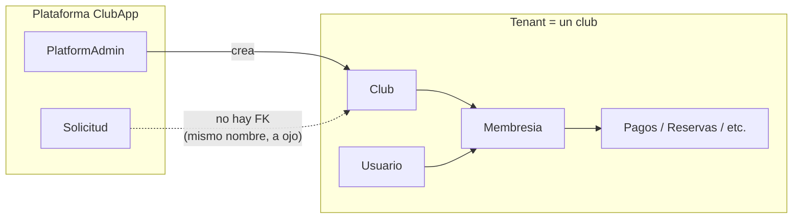
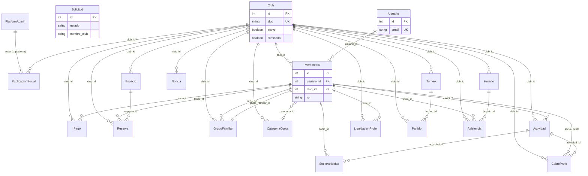
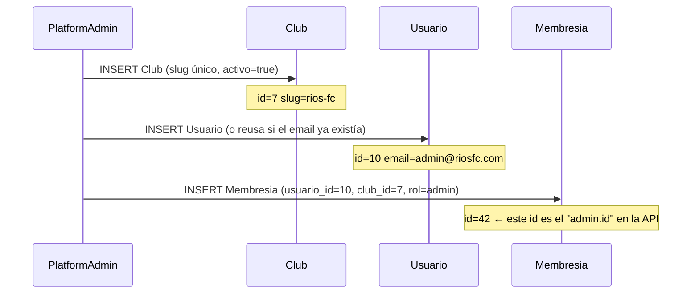
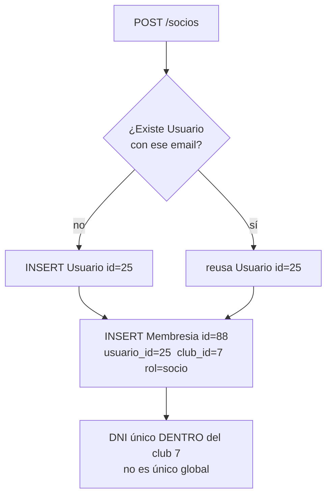
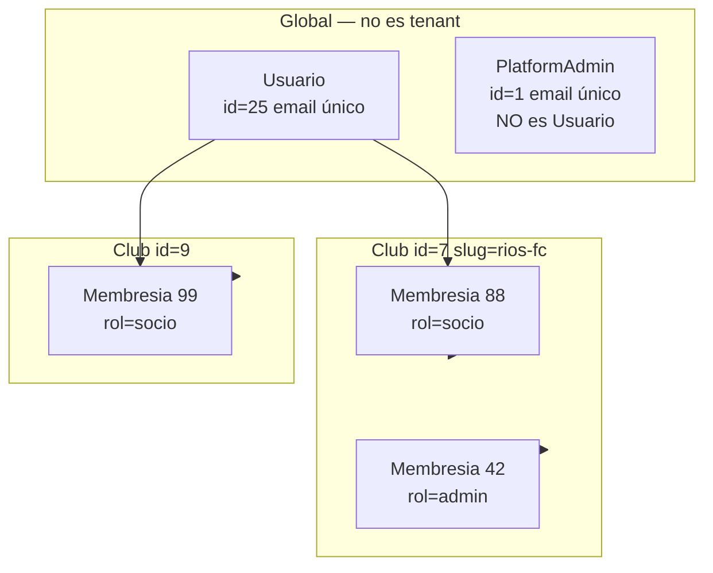

# Modelo de datos ClubApp

Fuente de verdad: `apps/api/prisma/schema.prisma`.  
Si este doc y un comentario viejo se contradicen, gana el schema.

PostgreSQL. Prisma. IDs enteros autoincrementales (`SERIAL`). Bajas lógicas: `eliminado = true` (casi nunca se borra la fila).

---

## Cómo pensarlo (3 mundos)

Hay tres grupos de tablas. No se mezclan.



| Mundo | Tablas | `club_id` | Para qué |
|-------|--------|-----------|----------|
| Plataforma | `PlatformAdmin` | no | Superadmin de ClubApp. No es un usuario de club. |
| Comercial | `Solicitud` | no | Lead de la landing. El club **todavía no existe**. |
| Tenant | todo lo demás | sí (salvo `Usuario`) | Un club = un tenant. Toda query de negocio filtra por `club_id` del JWT. |

`Usuario` es identidad de login **global** (email único en toda la plataforma).  
El vínculo con un club es `Membresia`. Un mismo mail puede estar en varios clubes: una fila `Usuario`, varias `Membresia`.

---

## La regla de IDs (la que más confunde)

En la API de negocio, **`id` de socio / admin / profe = `Membresia.id`**, no `Usuario.id`.

```
Usuario.id     = 10     → persona (email, password, DNI)
Membresia.id   = 42     → esa persona EN este club (rol, estado)
Club.id        = 7      → el tenant
```

JWT de club: `{ sub: 42, user_id: 10, role: "socio", club_id: 7, club_slug: "rios-fc" }`  
JWT de plataforma: `{ sub: platformAdmin.id, role: "platform" }` — **sin** `club_id`.

Cuando `Pago.socio_id = 42`, apunta a la **membresía**, no al usuario.

---

## Diagrama de relaciones

Las flechas son foreign keys. `Usuario` no tiene `club_id`: se cuelga del club solo a través de `Membresia`.



`Solicitud` **no tiene flecha a `Club`**. No hay `club_id` ni `solicitud_id`. Hoy se relacionan por el nombre del club, a mano.

---

## Historia: del lead al socio que paga

Números de ejemplo. En la DB real los pone el autoincrement.

### 1. Alguien llena el form de la landing

`POST /solicitudes` (público, sin JWT).

Se inserta **solo** en `Solicitud`. No se crea club. No se crea usuario.

| tabla | id | qué queda |
|-------|----|-----------|
| `Solicitud` | 3 | `nombre_club = "Rios FC"`, `estado = pendiente`, `email = cristian@…` |

Estados de la solicitud (pipeline comercial, no del tenant):

`pendiente` → `trial` → `aprobada`  (también `cancelada` / `borradas`)

---

### 2. Superadmin da de alta el club

`POST /platform/clubs` `{ nombre, admin_email, admin_nombre?, precio_usd_mes }`.

En **una transacción** se crean tres filas:



| tabla | id | FKs | nota |
|-------|----|-----|------|
| `Club` | **7** | — | `slug` único global (`rios-fc`). `activo=true`, `onboarding_completo=false`. |
| `Usuario` | **10** | — | Email único **global**. Password temporal. |
| `Membresia` | **42** | `usuario_id=10`, `club_id=7` | `rol=admin`. Unique `(usuario_id, club_id)`: esa persona no puede tener dos membresías en el mismo club. |

El JWT del admin es `{ sub: 42, user_id: 10, club_id: 7, role: "admin" }`.

Si el email ya existía (club dado de baja antes), **no** se duplica `Usuario`: se crea otra `Membresia` al club nuevo.

En paralelo, el superadmin puede marcar la `Solicitud` 3 como `trial`. Eso **no** escribe `club_id` en la solicitud. Sigue siendo otra tabla.

---

### 3. El admin completa onboarding

`PATCH /clubs/me/onboarding` → **update** de `Club` id=7 (titular, CUIT, colores, deportes, cuota…).  
No crea filas nuevas de club. Los espacios del onboarding van a `Espacio` con `club_id=7`.

---

### 4. El admin da de alta un socio

`POST /socios` `{ email, nombre, apellido, dni, … }`.

Otra transacción, mismo patrón: persona + vínculo al club.



| tabla | id | FKs | nota |
|-------|----|-----|------|
| `Usuario` | **25** | — | `juan@mail.com`, DNI `30111222` (el DNI vive acá, pero la unicidad se valida **por club** en la membresía). |
| `Membresia` | **88** | `usuario_id=25`, `club_id=7` | `rol=socio`, `estado=activo`. **Este 88** es el `socio.id` que usa el front. |

Si Juan después se anota en otro club, se crea `Membresia` id=99 con `usuario_id=25` y `club_id=otro`. Sigue siendo el mismo `Usuario` 25.

Un **profe** es exactamente lo mismo: `Membresia.rol = "profe"`. No hay tabla `Profe`.

---

### 5. Se cobra la cuota de septiembre

`POST /pagos/cobrar-mes` (o equivalente). Unique `(socio_id, mes, tipo)` → idempotente. Familia: un pago al titular.

| tabla | id | FKs | nota |
|-------|----|-----|------|
| `Pago` | 501 | `club_id=7`, `socio_id=88` | `mes="2026-09"`, `estado=pendiente` → `pagado`. `socio_id` es la **membresía**. |

---

### 6. Juan reserva una cancha

Primero el club creó el espacio:

| tabla | id | FKs |
|-------|----|-----|
| `Espacio` | 12 | `club_id=7` — Cancha 1, tipo `padel` |

Después la reserva:

| tabla | id | FKs |
|-------|----|-----|
| `Reserva` | 200 | `club_id=7`, `espacio_id=12`, `socio_id=88` |

Tres FKs, las tres del mismo tenant. Nunca una reserva de club 7 con un `socio_id` de club 8.

---

## Identidad (zoom)



Roles en `Membresia.rol`: `admin` | `entrada` | `socio` | `profe`.  
Staff = admin + entrada. Miembros = socio + profe.

Estados en `Membresia.estado`: `activo` | `moroso` | `suspendido`.  
Eso **no** es `Club.activo` (interruptor de plataforma: el club puede operar o está suspendido).

Baja de socio: `Membresia.eliminado = true`. El `Usuario` sigue vivo (puede tener otro club).  
Baja de club: `Club.eliminado=true` + `activo=false` + todas las membresías de ese club `eliminado=true`. El mail del admin se libera.

---

## Catálogo de tablas

Tipos Prisma → Postgres aproximado: `Int` = integer, `String` = text, `Float` = double precision, `Boolean` = boolean, `DateTime` = timestamp, `Json` = jsonb, `String[]` = text[].

`?` = nullable. **PK** = primary key. **UK** = unique. **FK** = foreign key.

### Fuera del tenant

#### `PlatformAdmin`

Superadmin ClubApp. Tabla propia, no comparte login con `Usuario`.

| columna | tipo | |
|---------|------|--|
| id | Int | PK |
| email | String | UK |
| password_hash | String | |
| nombre | String | |
| activo | Boolean | default true |
| created_at | DateTime | |

Sin FKs. JWT `role: platform`.

#### `Solicitud`

Lead comercial. **Sin** `club_id`.

| columna | tipo | |
|---------|------|--|
| id | Int | PK |
| nombre, apellido, nombre_club, email, telefono | String | |
| cantidad_miembros, cantidad_socios | Int | |
| eliminado | Boolean | default false |
| estado | String | `pendiente` \| `trial` \| `aprobada` \| `cancelada` \| `borradas` |
| fecha_solicitud | DateTime | al crear |
| fecha_trial, fecha_aprobada, fecha_cancelada, fecha_eliminada | DateTime? | se pisan al cambiar estado |
| mail_aviso_trial_enviado | Boolean | |
| created_at, updated_at | DateTime | |

Índices: `(estado, eliminado)`, `(eliminado)`.

---

### Núcleo del tenant

#### `Club`

El tenant. Casi todo lo demás apunta acá.

| columna | tipo | |
|---------|------|--|
| id | Int | PK — el `club_id` de todas las tablas de negocio |
| slug | String | UK global. Sale del nombre al crear (`rios-fc`) |
| nombre | String | único entre clubes **vivos** (activo o suspendido); baja libera el nombre |
| logo_url | String? | |
| color_primario | String | default `#2563eb` |
| color_secundario, color_terciario | String? | |
| plan | String | nombre del tramo, ej. `Hasta 50 socios` |
| precio_usd_mes | Float | lo que el club paga a ClubApp (no cambia hasta confirmar + próximo ciclo) |
| plan_hasta | Int | tope de socios del plan que están pagando |
| plan_consentido_hasta | Int | hasta dónde ya aceptaron agregar socios (no re-mostrar el modal) |
| plan_pendiente_* | | upgrade pendiente: precio, hasta, fechas, token del mail |
| cuota_monto | Float | cuota **Socio pleno** (espejo de la categoría default) |
| regla_moroso_cuotas | Int | |
| bloquear_reservas, bloquear_entrada, cumples_auto | Boolean | |
| max_reservas_activas, cancelar_reserva_horas | Int | |
| **activo** | Boolean | default true. Interruptor de plataforma (suspender / reactivar). **No** es el estado de la solicitud |
| **eliminado** | Boolean | baja lógica del tenant |
| onboarding_completo | Boolean | |
| cuit_cuil, titular_nombre, titular_apellido | String? | |
| direccion, provincia, ciudad, telefono_club, email_contacto | String? | |
| ubicacion_json | Json? | |
| deportes | String[] | declarados en onboarding |
| descuento_familiar_pct | Float | 0–100; al cobrar el mes se aplica a la suma familiar (2+ socios no bonificados) |

Índice: `(eliminado)`, `(plan_pendiente_confirmado_at)`.

#### `PlanTramo`

Tabla de **plataforma** (sin `club_id`). Tramos de precio SaaS que edita Superadmin.

| columna | tipo | |
|---------|------|--|
| nombre | String | en español, ej. `Hasta 50 socios` |
| desde / hasta | Int | `hasta` null = sin techo |
| precio_usd | Float | |
| orden | Int | |

#### `Usuario`

Persona que se loguea. Email único en toda la DB.

| columna | tipo | |
|---------|------|--|
| id | Int | PK |
| email | String | UK global |
| password_hash | String | |
| nombre | String | |
| apellido, dni, telefono | String | default `""` |
| fecha_nacimiento | DateTime? | |
| created_at | DateTime | |

#### `Membresia`

“Esta persona, en este club, con este rol.” **Esta es la PK que usa la API.**

| columna | tipo | |
|---------|------|--|
| id | Int | PK — el `id` plano de socio/admin/profe |
| usuario_id | Int | FK → `Usuario.id` (Cascade al borrar usuario) |
| club_id | Int | FK → `Club.id` |
| rol | String | `admin` \| `entrada` \| `socio` \| `profe` |
| estado | String | `activo` \| `moroso` \| `suspendido` |
| eliminado | Boolean | baja lógica en **este** club |
| must_change_password | Boolean | |
| grupo_familiar_id | Int? | FK → `GrupoFamiliar.id` |
| categoria_id | Int? | FK → `CategoriaCuota.id` (cuota; staff suele ir null) |

Unique: `(usuario_id, club_id)`.  
Índices: `club_id`, `usuario_id`, `(club_id, rol)`, `(club_id, eliminado)`, `grupo_familiar_id`, `categoria_id`.

---

### Familia, actividades, cobros de profe

#### `CategoriaCuota`

Tipos de socio del club y el monto que se cobra al generar el mes.

| columna | tipo | |
|---------|------|--|
| id | Int | PK |
| club_id | Int | FK → Club |
| nombre | String | ej. `Socio pleno`, `Deportivo` |
| slug | String | único por club (`socio-pleno`) |
| monto | Float | |
| es_default | Boolean | una sola: Socio pleno |
| eliminado | Boolean | |

Unique: `(club_id, slug)`. Al crear el club se inserta Socio pleno con `Club.cuota_monto`.

#### `GrupoFamiliar`

| columna | tipo | |
|---------|------|--|
| id | Int | PK |
| club_id | Int | FK → Club |
| nombre | String | |
| titular_id | Int | FK → `Membresia.id` |
| eliminado | Boolean | |

Los miembros se cuelgan al revés: `Membresia.grupo_familiar_id`.

#### `Actividad`

| columna | tipo | |
|---------|------|--|
| id | Int | PK |
| club_id | Int | FK → Club |
| nombre | String | |
| modo_cobro | String | `club` \| `profe` |
| monto_adicional | Float | |
| profe_id | Int? | FK → `Membresia.id` (el profe a cargo) |
| comision_tipo | String? | `porcentaje` \| `fijo` |
| comision_valor | Float? | |
| activo, eliminado | Boolean | |

#### `SocioActividad`

Tabla puente. PK compuesta.

| columna | tipo | |
|---------|------|--|
| socio_id | Int | PK + FK → Membresia (Cascade) |
| actividad_id | Int | PK + FK → Actividad (Cascade) |

#### `CobroProfe`

| columna | tipo | |
|---------|------|--|
| id | Int | PK |
| club_id | Int | FK → Club |
| actividad_id | Int | FK → Actividad |
| socio_id | Int | FK → Membresia (alumno) |
| profe_id | Int | FK → Membresia (profe) |
| mes | String | |
| monto_alumno, comision_club | Float | |
| cobrado | Boolean | |
| medio | String | default `efectivo` |
| nota | String? | |

Unique: `(actividad_id, socio_id, mes)`.

#### `LiquidacionProfe`

| columna | tipo | |
|---------|------|--|
| id | Int | PK |
| club_id | Int | FK → Club |
| profe_id | Int | FK → Membresia |
| mes | String | |
| total_club | Float | |
| estado | String | `pendiente` \| `pagada` |
| mp_init_point | String? | |
| fecha_pago | DateTime? | |

Unique: `(profe_id, mes)`.

---

### Cuotas (MercadoPago del club, no de ClubApp)

#### `Pago`

| columna | tipo | |
|---------|------|--|
| id | Int | PK |
| club_id | Int | FK → Club |
| socio_id | Int | FK → Membresia (quien paga: el socio o el titular de la familia) |
| grupo_familiar_id | Int? | FK → GrupoFamiliar si el cobro es del grupo |
| tipo | String | `cuota` (default) \| `inscripcion` |
| concepto | String? | ej. `Familia Pérez · 3 socios`, `Inscripción 1/3` |
| mes | String | `YYYY-MM` |
| monto | Float | |
| estado | String | `pendiente` \| `pagado` |
| mp_preference_id, mp_init_point | String? | |
| fecha_pago | DateTime? | |

Unique: `(socio_id, mes, tipo)` — cobrar el mismo mes dos veces reusa la fila de ese tipo.

#### `BonificacionCuota`

Meses de cuota mensual que no se generan al cobrar.

| columna | tipo | |
|---------|------|--|
| id | Int | PK |
| club_id | Int | FK → Club |
| socio_id | Int | FK → Membresia |
| mes | String | `YYYY-MM` |

Unique: `(socio_id, mes)`.

---

### Espacios y reservas

#### `Espacio`

| columna | tipo | |
|---------|------|--|
| id | Int | PK |
| club_id | Int | FK → Club |
| nombre, tipo | String | |
| descripcion | String? | |
| activo, eliminado | Boolean | |
| duracion_slot_min | Int | default 60 |
| precio_opcional | Float? | |
| hora_apertura, hora_cierre | String | `"08:00"` / `"23:00"` |

#### `Reserva`

| columna | tipo | |
|---------|------|--|
| id | Int | PK |
| club_id | Int | FK → Club |
| espacio_id | Int | FK → Espacio |
| socio_id | Int | FK → Membresia |
| inicio, fin | DateTime | |
| estado | String | `confirmada` \| `cancelada` \| `no_show` |
| nota | String? | |
| created_at | DateTime | |

---

### Horarios, asistencia, noticias

#### `Horario`

| columna | tipo | |
|---------|------|--|
| id | Int | PK |
| club_id | Int | FK → Club |
| titulo | String | |
| dias | String | ej. `lun,mie,vie` |
| hora_inicio, hora_fin | String | |
| profe_id | Int? | **sin FK Prisma** — se guarda el id de membresía a mano |
| activo, eliminado | Boolean | |

#### `Asistencia`

| columna | tipo | |
|---------|------|--|
| id | Int | PK |
| club_id | Int | FK → Club |
| horario_id | Int | FK → Horario |
| socio_id | Int | FK → Membresia |
| fecha | Date | |
| estado | String | `presente` \| `ausente` \| `justificado` |
| marcada_por | Int | **sin FK** — membresía de quien marcó |

Unique: `(horario_id, socio_id, fecha)`.

#### `Noticia`

Comunicado **del club** (panel comisión).

| columna | tipo | |
|---------|------|--|
| id | Int | PK |
| club_id | Int | FK → Club |
| titulo, cuerpo | String | |
| imagen_url | String? | |
| es_evento | Boolean | |
| fecha | DateTime | |
| published, eliminado | Boolean | |

#### `PublicacionSocial`

Feed **entre clubes** (no es `Noticia`). `club_id` opcional.

| columna | tipo | |
|---------|------|--|
| id | Int | PK |
| club_id | Int? | FK → Club (nullable) |
| autor_tipo | String | `admin` \| `platform` |
| autor_id | Int | **sin FK** — `Membresia.id` o `PlatformAdmin.id` según `autor_tipo` |
| titulo, cuerpo | String | |
| imagen_url, lugar | String? | |
| fecha_evento | DateTime? | |
| visible, eliminado | Boolean | |
| created_at, updated_at | DateTime | |

---

### Torneos

#### `Torneo`

| columna | tipo | |
|---------|------|--|
| id | Int | PK |
| club_id | Int | FK → Club |
| nombre, deporte | String | |
| estado | String | default `activo` |

#### `Partido`

| columna | tipo | |
|---------|------|--|
| id | Int | PK |
| torneo_id | Int | FK → Torneo (Cascade) |
| club_id | Int | FK → Club (redundante a propósito: aislamiento tenant) |
| rival_a, rival_b | String | |
| fecha | DateTime? | |
| goles_a, goles_b | Int? | |
| jugado | Boolean | |

---

## Uniques que importan

| tabla | unique | por qué |
|-------|--------|---------|
| Club | `slug` | URL / tenant (`rios-fc`) |
| Usuario | `email` | un login, muchos clubes |
| Membresia | `(usuario_id, club_id)` | no duplicar a la persona en el mismo club |
| Pago | `(socio_id, mes, tipo)` | una cuota o inscripción por mes |
| BonificacionCuota | `(socio_id, mes)` | no generar cuota ese mes |
| CobroProfe | `(actividad_id, socio_id, mes)` | |
| LiquidacionProfe | `(profe_id, mes)` | |
| Asistencia | `(horario_id, socio_id, fecha)` | |
| SocioActividad | `(socio_id, actividad_id)` | PK compuesta |
| PlatformAdmin | `email` | |

DNI: no hay unique en DB. La API lo valida **por club** (entre membresías vivas de ese `club_id`).

---

## Columnas que parecen FK pero no lo son

Prisma no las declara como relación. El código las trata como id de membresía (o platform admin):

| tabla.columna | se espera que sea |
|---------------|-------------------|
| `Horario.profe_id` | `Membresia.id` |
| `Asistencia.marcada_por` | `Membresia.id` |
| `PublicacionSocial.autor_id` | `Membresia.id` o `PlatformAdmin.id` según `autor_tipo` |

`Solicitud` no apunta a `Club`. Si más adelante hace falta “este club está en trial” en el directorio, el camino es agregar `club_id` (o `solicitud_id`), no mezclar `Club.activo` con `Solicitud.estado`.

---

## Receta mental para cualquier alta de negocio

1. El JWT ya trae `club_id`. Nunca se lee del body.
2. Se inserta la fila **con ese** `club_id`.
3. Si hay persona (socio, admin, profe, titular de reserva), el FK es `Membresia.id`.
4. Soft delete: `eliminado=true`. El id no se recicla; la fila queda.
5. Listados: `WHERE club_id = JWT.club_id AND eliminado = false`.
